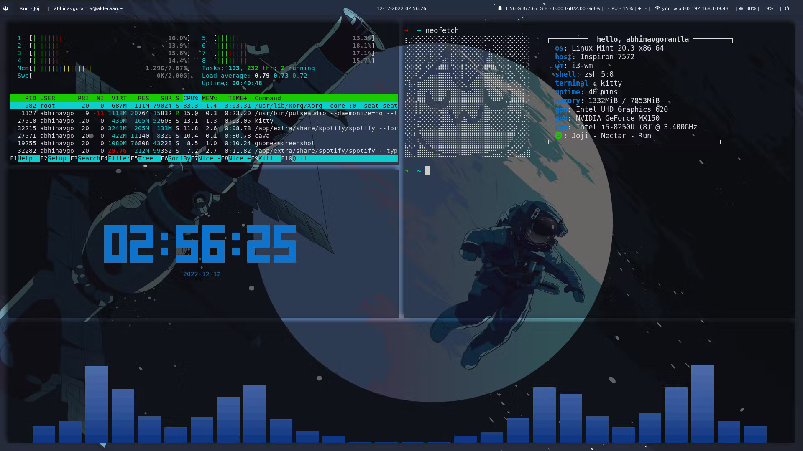
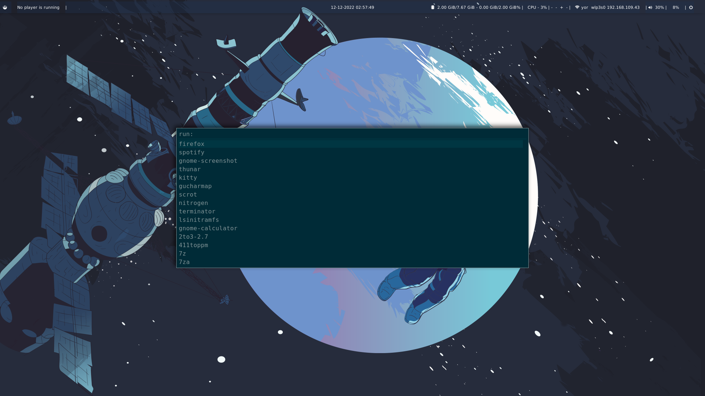

<h1> Dotfiles for my linux setup </h1>

My current linux setup.
<ol>
  <li>Operating System: Linux Mint</li>
  <li>Window Manager: i3</li>
  <li>Polybar</li>
  <li>Rofi</li>
</ol>

<h1>Screenshots</h1>

